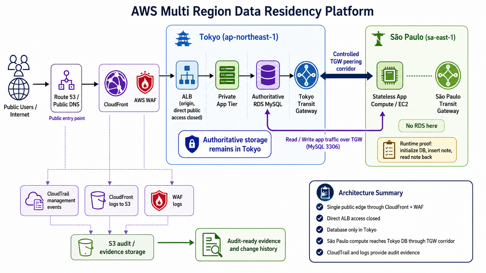

# aws-multi-region-data-residency-platform

A Terraform-based AWS multi-region platform that separates global application access from authoritative data storage by running compute in São Paulo while preserving database residency in Tokyo.

## Overview

`aws-multi-region-data-residency-platform` is a portfolio project built around a controlled multi-region AWS architecture for data residency, cross-region compute, edge security, and audit-ready evidence.

The platform keeps authoritative database storage in Tokyo (`ap-northeast-1`) while allowing application compute to run in São Paulo (`sa-east-1`). The two regions are connected through a deliberate Transit Gateway peering corridor, allowing the compute region to reach the data region without duplicating the database outside Tokyo.

This project goes beyond simple infrastructure provisioning. In addition to VPCs, routing, EC2, RDS, and Transit Gateway peering, it includes:

- Tokyo-only database residency validation
- São Paulo compute-only deployment
- controlled cross-region TGW routing
- CloudFront edge access
- AWS WAF inspection and logging
- direct-origin protection for the ALB
- CloudTrail management-event evidence
- S3-based log and audit storage
- screenshot indexes, proof files, and auditor-facing documentation

The result is a more realistic cloud engineering project: not just multi-region deployment, but also runtime validation, security evidence, and audit explanation.

## Core Platform Capabilities

This repository is organized around four platform capabilities.

## 1. Data Residency and Regional Separation

Focuses on keeping authoritative application data in Tokyo while allowing compute to run in a separate AWS region.

Includes:

- authoritative RDS MySQL database in Tokyo
- no duplicate RDS instance in São Paulo
- Tokyo as the source-of-truth data region
- São Paulo as a compute-only region
- CLI evidence proving database presence in Tokyo and absence in São Paulo
- documentation explaining the data-residency boundary

## 2. Cross-Region Network Corridor

Focuses on controlled private connectivity between the compute region and the data region.

Includes:

- Tokyo Transit Gateway
- São Paulo Transit Gateway
- cross-region TGW peering attachment
- route-table entries for remote CIDR blocks
- security-group rules allowing MySQL traffic over the corridor
- network validation from São Paulo EC2 to Tokyo RDS on port `3306`
- application-level proof that São Paulo can write to and read from the Tokyo database

## 3. Edge Security and Origin Protection

Focuses on controlled public access to the application.

Includes:

- Route 53 public DNS
- CloudFront as the public edge layer
- AWS WAF attached to CloudFront
- WAF logging to CloudWatch Logs
- CloudFront standard logs delivered to S3
- ALB origin protection
- security group hardening so direct public ALB access is closed

## 4. Audit Evidence and Operational Validation

Focuses on proving that the architecture can be reviewed, explained, and defended.

Includes:

- CloudTrail management-event history
- evidence for security group changes
- evidence for TGW peering and route creation
- evidence for WAF association and logging configuration
- evidence for CloudFront distribution updates
- S3 log and audit bucket validation
- versioning and encryption checks
- CloudTrail log validation
- auditor narrative and verification reports

## What This Project Builds

At a high level, this project provisions and validates:

- a Tokyo VPC for the authoritative data region
- a São Paulo VPC for the compute region
- private RDS MySQL in Tokyo
- EC2 application compute in São Paulo
- Transit Gateways in both regions
- cross-region TGW peering
- route-table logic for both regional CIDR blocks
- security-group rules for controlled MySQL access
- CloudFront public edge access
- AWS WAF inspection and logging
- ALB origin protection
- CloudTrail-based change tracking
- S3-backed log and audit evidence storage
- verification reports, screenshots, and proof files

## Architecture Summary

This project uses a global-access / regional-storage architecture.

Public users enter through Route 53, CloudFront, and AWS WAF. CloudFront provides the public edge, while WAF evaluates and logs request traffic. Direct public access to the ALB origin is closed so traffic is forced through the intended edge path.

Tokyo acts as the authoritative data region. The RDS database remains in Tokyo and is not duplicated in São Paulo.

São Paulo acts as the compute region. Application compute can run there, but it reaches the Tokyo database only through the controlled Transit Gateway corridor.

The cross-region path is explicit:

- São Paulo VPC routes Tokyo CIDR traffic toward the São Paulo TGW
- São Paulo TGW sends that traffic through the TGW peering attachment
- Tokyo TGW receives the traffic and routes it toward the Tokyo VPC
- Tokyo security groups allow MySQL traffic from the São Paulo CIDR
- the application validates the path by writing and reading database records

This design demonstrates a layered approach:

- public access is controlled at the edge
- storage remains in the authoritative region
- compute can operate cross-region without duplicating the database
- private routing is deliberate and reviewable
- changes are traceable through CloudTrail
- logs and screenshots support audit review

## Architecture Diagram



## Terraform Design

The infrastructure is organized into reusable Terraform modules and regional environments.

Major module areas include:

- `network`
- `network_spoke`
- `security`
- `security_spoke`
- `iam`
- `database`
- `app_ec2`
- `endpoints`
- `monitoring`
- `incident_reporter`

The regional environments are separated into:

- `Terraform/environments/tokyo`
- `Terraform/environments/saopaulo`

This makes the platform easier to reason about because each region has a clear role. Tokyo owns the authoritative data layer. São Paulo owns compute-side access. Shared modules provide the reusable building blocks.

## Validation and Evidence

This repository includes evidence that the platform was not just defined in Terraform, but actually validated.

## Data Residency Validation

Evidence demonstrates that:

- the RDS instance exists in Tokyo
- the Tokyo RDS endpoint is active
- São Paulo has no RDS instance
- the authoritative database is not duplicated outside Japan

This supports the central data-residency claim of the project.

## Cross-Region Connectivity Validation

Evidence demonstrates that:

- Tokyo and São Paulo TGWs are available
- the TGW peering attachment is available
- route tables in both regions contain explicit remote CIDR routes
- São Paulo EC2 can reach Tokyo RDS on port `3306`
- the São Paulo application can insert a database record
- the Tokyo path can read the same record back

This proves the cross-region corridor works at both the network layer and the application layer.

## Edge and Origin Protection Validation

Evidence demonstrates that:

- public traffic reaches CloudFront
- CloudFront response headers are present
- WAF is attached to the edge path
- WAF logs contain real request events
- direct public access to the ALB origin is closed
- the ALB security group no longer allows broad public ingress

This proves that public traffic is controlled through the intended edge layer.

## Audit and Change Validation

Evidence demonstrates that CloudTrail recorded:

- security group changes
- TGW peering creation
- TGW peering acceptance
- TGW route creation
- WAF association
- WAF logging configuration
- CloudFront distribution updates
- logging delivery configuration

This creates a management-event history that explains who changed important parts of the environment, when the changes happened, and which AWS APIs were involved.

## Repository Structure

```text
.
├── README.md
├── docs/
│   └── incidents/
├── evidence/
│   ├── cross-region-connectivity/
│   │   ├── Screenshots/
│   │   ├── screenshots-index.md
│   │   └── verification-report.md
│   └── data-residency-and-audit/
│       ├── 00_architecture-summary.md
│       ├── 01_data-residency-proof.md
│       ├── 02_edge-proof-cloudfront.md
│       ├── 03_waf-proof.md
│       ├── 04_cloudtrail-change-proof.md
│       ├── 05_network-corridor-proof.md
│       ├── auditor-narrative.md
│       ├── screenshots-index.md
│       └── verification-report.md
├── scripts/
│   ├── collect.sh
│   └── python/
└── Terraform/
    ├── environments/
    │   ├── tokyo/
    │   └── saopaulo/
    └── modules/
        ├── app_ec2/
        ├── database/
        ├── endpoints/
        ├── iam/
        ├── incident_reporter/
        ├── monitoring/
        ├── network/
        ├── network_spoke/
        ├── security/
        └── security_spoke/

